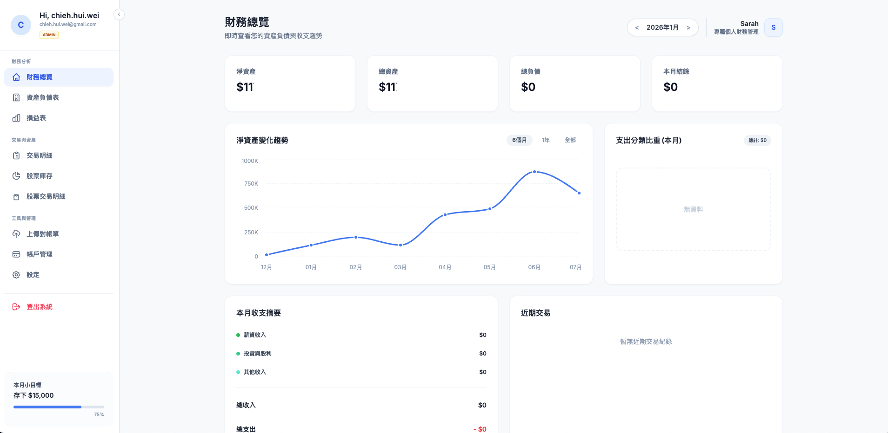
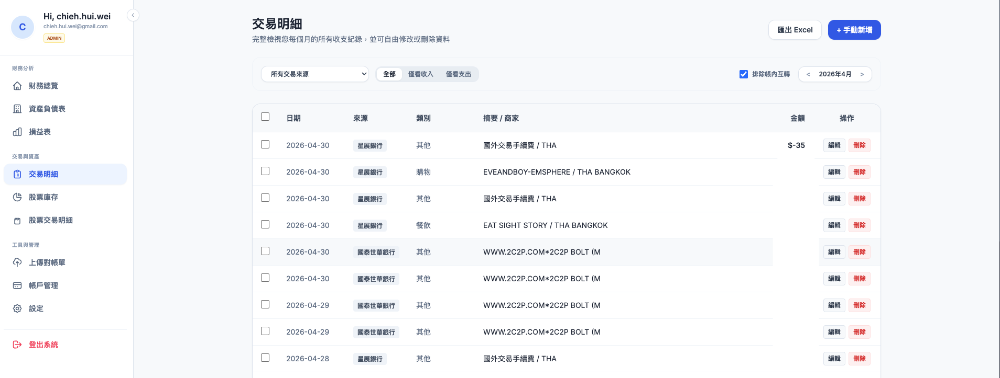
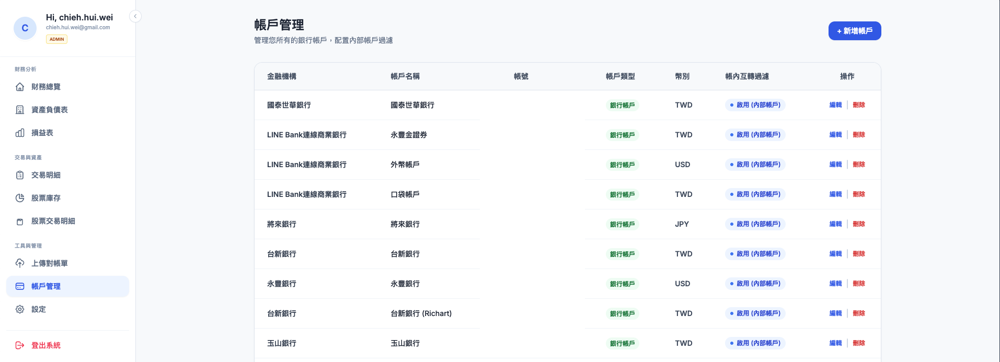

# pocketCFO — 智能個人財務與淨資產監控系統

`pocketCFO` 是一款專為個人設計的開源、自主託管財務管理系統。它能**自動解析電子對帳單**，將分散在各家銀行、信用卡與證券商的數據進行整合，並自動生成每月的 **資產負債表 (Balance Sheet)** 與 **損益表 (Income Statement)**，助您精準掌握個人淨資產與真實現金流。

### 為什麼選擇 pocketCFO？

* 💡 **免手動記帳**：利用 **Google Gemini 大語言模型** 進行智能 OCR 與語意解析，直接上傳銀行、信用卡、證券 PDF 對帳單即可自動擷取結構化交易明細。
* 🔍 **精準剔除干擾**：內建智慧偵測引擎，自動排除帳戶互轉、信用卡繳款、貸款還本等「資產挪動」交易，避免虛增收支，呈現最真實的儲蓄率與生活花費。
* 📈 **證券資產自動估值**：整合台灣主流券商 API（台新、永豐金 Shioaji、玉山 Fugle）與海外券商（Firstrade），自動更新持股庫存，根據收盤現價即時估算未實現損益。

---

## 特色功能

| 功能 | 說明 |
|------|------|
| **AI 對帳單解析** | 支援多家銀行、信用卡與證券 PDF。透過 Gemini 擷取交易時間、分類、金額與帳號，並支援**台灣綜合對帳單**（自動分離台幣存款與證券資產）。 |
| **資產負債表** | 自動加總現金餘額與股票市值，扣除信用卡負債，產出清晰的資產佔比圖表與淨資產走勢。 |
| **真實收支損益** | 智慧分類生活支出（如食物、交通、保險、運動等）。**自動過濾卡費與貸款還本**，真實反映每月的收支差額與儲蓄率。 |
| **券商持股同步** | 支援券商 API 憑證同步，或手動登錄持股。背景排程器（每月最後一天 22:00）自動同步持倉並重算財務報表。 |
| **流暢互動體驗** | 基於 React + Zustand 狀態管理，配備響應式側邊欄、API 連線診斷工具、解析進度追蹤，並使用非阻塞式 Toast 彈窗提供極佳體驗。 |
| **PDF 財務報表** | 提供一鍵生成與下載企業級排版的 PDF 財務報表功能。 |

---

## 系統介面展示

### 財務總覽 (Dashboard)


### 交易明細 (Transactions)


### 帳戶管理 (Accounts)


---

## Google AI Studio API Key 設定

本系統使用 Google Gemini 大語言模型解析對帳單，您必須設定 Google AI Studio API 金鑰才能啟用解析功能：

1. 前往 [Google AI Studio](https://aistudio.google.com/) 申請免費或付費的 API Key。
2. 在專案根目錄的 `.env` 檔案中，設定 `GEMINI_API_KEY` 變數：
   ```env
   GEMINI_API_KEY=您的_Google_AI_Studio_API_Key
   ```

---

## 系統安全防護與登入設定


為防止他人隨意瀏覽您的財務資訊，本系統已啟用登入解鎖機制：

1. **認證機制**：採用安全的 JSON Web Token (JWT) 及靜態密碼解鎖機制，每次成功登入可維持 7 天解鎖狀態。
2. **修改密碼**：
   - 系統預設解鎖密碼為 `admin`。
   - 若要修改，請在根目錄的 `.env` 檔案中新增或變更 `APP_PASSWORD` 變數：
     ```env
     APP_PASSWORD=您的安全解鎖密碼
     ```
   - 密碼驗證在後端使用時序安全比較，防止旁路洩漏。
3. **JWT 簽章**：系統將自動使用 `.env` 中的 `APP_SECRET_KEY` 對登入 Token 進行安全簽章。

---

## 股票與帳戶管理說明

### 帳戶管理 (Accounts)
* **帳戶管理頁面** 僅用來管理日常的 **銀行帳戶** 與 **設定內部帳戶過濾**（轉帳排除）。
* 為了簡化管理，**證券與券商帳戶**已被獨立出帳戶管理頁面，統一移至 **「股票庫存」** 頁面進行配置與新增。

### 手動股票庫存 (Manual Stock Holdings)
若您使用的券商（如永豐金證券）目前沒有啟用 API 同步，或是 API 連線有問題：
1. 前往 **「股票庫存」** 頁面。
2. 點擊左下角 **「+ 新增證券帳戶」**，建立您自訂的券商名稱。
3. 選取該券商後，點選 **「編輯 / 手動登錄此月庫存」**，即可手動增加持股（輸入代號、股數、平均成本、收盤現價等）。
4. 點選 **「儲存本月股票庫存」** 後，系統將自動計算估算市值與未實現損益，並同步更新至資產負債表。

---

## 專案架構

```
pocketCFO/
├── main.py                          # FastAPI 進入點
├── pyproject.toml
├── .env.example
├── src/
│   ├── controllers/                 # FastAPI routers (HTTP 層)
│   │   ├── upload_controller.py     #   PDF 上傳與 Gemini 解析
│   │   ├── balance_sheet_controller.py
│   │   ├── income_statement_controller.py
│   │   └── account_controller.py
│   ├── instances/                   # 單例 / 配置
│   │   ├── config.py                #   Pydantic-Settings (.env)
│   │   ├── database.py              #   SQLAlchemy 連線
│   │   └── gemini.py                #   Gemini AI 用戶端
│   ├── dbs/                         # 資料層
│   │   ├── models.py                #   SQLAlchemy ORM models
│   │   └── repository.py            #   DB 存取 Repository
│   ├── services/                    # 業務邏輯
│   │   ├── statement_service.py     #   對帳單解析調度
│   │   ├── balance_sheet_service.py #   資產負債表運算
│   │   ├── income_statement_service.py # 損益表運算（含跨行轉帳過濾）
│   │   ├── scheduler.py             #   自動排程同步 (每月最後一天 22:00)
│   │   └── parsers/
│   │       └── bank_statement_parser.py # Gemini 銀行對帳單 Prompt 定義
│   └── utils/
│       ├── date_utils.py
│       └── transfer_detector.py     #   帳內互轉智慧偵測
└── frontend/                        # React + Vite + Tailwind
    └── src/
        ├── components/
        │   └── ToastContainer.tsx   #   全域 Toast 視窗元件
        ├── store/
        │   └── useToastStore.ts     #   Zustand 狀態管理 (Toast)
        ├── pages/
        │   ├── DashboardPage.tsx    #   儀表板
        │   ├── BalanceSheetPage.tsx #   資產負債表及餘額調整
        │   ├── StockHoldingsPage.tsx #  股票庫存與手動登錄
        │   └── UploadPage.tsx       #   對帳單上傳與解析預覽
```

---

## 快速開始

### 1. 安裝後端

```bash
cd pocketCFO
cp .env.example .env
# 填入 GEMINI_API_KEY 以及券商設定

pip install -e ".[dev]"
python main.py
# → http://localhost:8000/docs
```

### 2. 安裝前端

```bash
cd frontend
npm install
npm run dev
# → http://localhost:5173
```

### 3. 或用 Docker Compose

```bash
cp .env.example .env
docker compose up --build
```

## 使用流程

### 每月例行作業

1. 上傳對帳單（於上傳頁面上傳）
   - 銀行對帳單 PDF（如台新銀行存款明細）
   - 信用卡帳單 PDF（如台新 @GoGo 卡）
   - 證券對帳單 PDF（如永豐金豐存股明細、Firstrade 對帳單）

2. API 同步券商（可選，即時拉取目前持倉）

3. 查看報表
   - 切換至資產負債表頁面或收支表頁面，選取指定的年份與月份，系統將自動計算並即時呈現最新的財務狀態。

### 帳戶互轉處理

`TransferDetector` 透過以下策略自動排除帳戶間轉帳：

1. **關鍵字比對**：「跨行轉帳」「ATM轉帳」「轉入」「匯入款」等
2. **帳號與註記比對**：比對交易描述中是否包含已設定之內部帳戶的帳號號碼或備註。
3. **金額配對**（進階）：`TransferDetector.pair_transfers()` — 在不同帳戶的交易中找出金額與日期相近的借貸配對。

**設定方式：**
直接在網頁的 **帳戶管理** 設定中，為指定帳戶啟用「帳內互轉」/「內部帳戶」屬性，系統在解析時將會自動比對該帳戶的帳號與備註資訊，無須設定任何環境變數。

## 券商 API 設定

### 永豐金（豐存股）

使用 [shioaji](https://sinotrade.github.io/) Python SDK：

```bash
pip install shioaji
```

1. 請至 [永豐金 API 金鑰與憑證管理](https://sinotrade.github.io/quickstart/) 申請 API Key 與 Secret Key。
2. 於線上簽署風險預告書並下載個人電子憑證（`.pfx` 格式）。
3. 將憑證上傳至系統或放置於設定之專案目錄中（詳見 [Shioaji 憑證啟用步驟](https://sinotrade.github.io/quickstart/)）。

### 台新證券

使用 REST API + mTLS 客戶端憑證：

1. 洽詢營業員開通 API 交易權限，並至 [台新證券 Nova API 專區](https://vertexaisearch.cloud.google.com/grounding-api-redirect/AUZIYQHJ6NcsO_jWuVuKXIlIb8PBTPl99H-t5JjVY6jir1SRWeYeVFRAD_EfHKvERUGVb6qDvFDve98_7NTmWtD1eL-Y1pmPth00EeDavVux86OrELm38pfAzKNM71Pcx4fx2Mz-J1OsO-4=) 參閱說明。
2. 使用台新提供的「憑證快遞」或「憑證 e 管家」申請並匯出 `.pfx` 格式憑證。
3. 將憑證檔案上傳或放置於憑證目錄中。

### 玉山證券 (Fugle)

使用 Fugle 富果合作 API：

1. 登入 [玉山證券交易 API 官網 (Fugle)](https://developer.fugle.tw/) 線上簽署 API 服務申請書暨聲明書。
2. 通過審核後，登入金鑰管理頁面申請憑證並匯出 `.p12` 格式憑證。
3. 詳細說明與 API 技術文件請參考 [玉山證券程式交易 API 技術文件](https://vertexaisearch.cloud.google.com/grounding-api-redirect/AUZIYQGOiLEPOYHUBqV_xL7b_DxKIK-1TNqtBFX7n950it3k9iOQK18_jNlUoLumNslCg9oSyuCKjiF_6rkfYl0cs7z-EMbDl_5u7vuBGeixyYBGQjP4mV9fZBr7W21PBZHgR5zpXorAWtA9NpgovJWuZRc=)。

## 資料模型

```
Account (帳戶)
  └── AccountSnapshot (每月餘額快照)
  └── Security (持股)
  └── Transaction (交易記錄)
  └── CreditCardBill (信用卡帳單)
        └── CreditCardItem (帳單明細)

BalanceSheet (計算結果)
IncomeStatement (計算結果)
```
